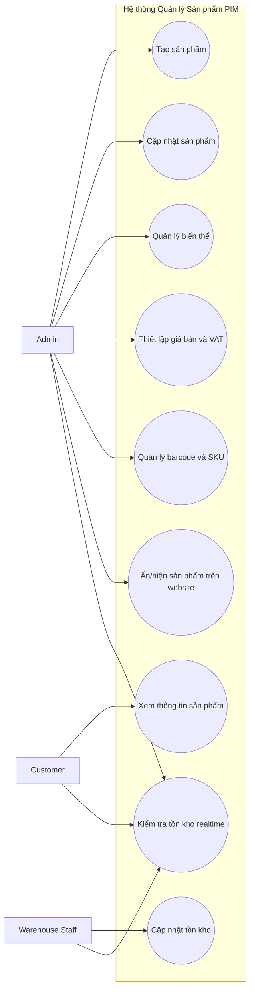
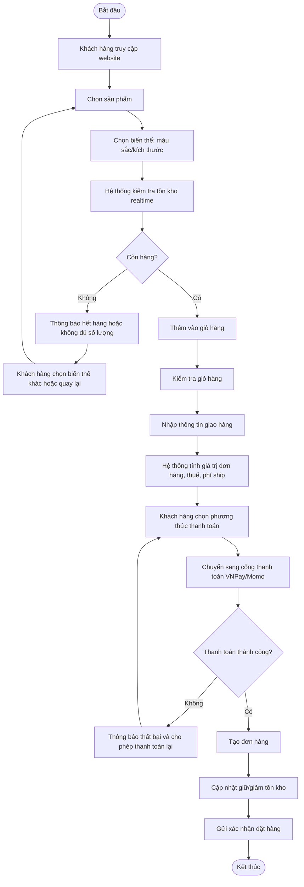

# SRS – Chức năng Quản lý Sản phẩm (PIM)

## 1. Thông tin tài liệu
- **Dự án:** Website bán thiết bị ngành ảnh Kochi Lens
- **Phạm vi tài liệu:** Đặc tả yêu cầu phần mềm cho chức năng **[2.1] Quản lý Sản phẩm (PIM)**
- **Mục tiêu:** Chuẩn hóa cách quản lý sản phẩm, biến thể và tồn kho hiển thị realtime để phục vụ bán hàng trực tuyến và đồng bộ dữ liệu về BackEnd cho kho và kế toán.

---

## 2. Bối cảnh dự án
Kochi Lens cần xây dựng một website thương mại điện tử chuyên bán thiết bị ngành ảnh. Hệ thống phải cho phép khách hàng tìm kiếm và đặt mua sản phẩm trực tuyến. Dữ liệu đơn hàng sau khi phát sinh phải được chuyển về BackEnd để:
- Bộ phận **kho** chuẩn bị hàng và đóng gói.
- Bộ phận **kế toán** thực hiện xuất hóa đơn.

Trong phạm vi tài liệu này, chức năng được tập trung phân tích là **Quản lý Sản phẩm (PIM)**, bao gồm:
- Quản lý danh mục sản phẩm.
- Quản lý biến thể sản phẩm theo màu sắc, kích thước hoặc thuộc tính khác.
- Hiển thị tồn kho realtime.
- Cung cấp dữ liệu sản phẩm chính xác cho website bán hàng và quy trình xử lý đơn hàng.

---

# Phần 1: Mô hình hóa quy trình (Business Flow)

## 1.1. Sơ đồ Use Case
### 1.1.1. Mục tiêu
Xác định các tác nhân chính và các nghiệp vụ liên quan đến chức năng PIM trong hệ thống.

### 1.1.2. Actor
- **Admin:** Quản trị sản phẩm, biến thể, giá bán, barcode, VAT và trạng thái hiển thị.
- **Customer:** Xem thông tin sản phẩm, chọn biến thể, kiểm tra tồn kho trước khi đặt hàng.
- **Warehouse Staff:** Cập nhật tồn kho thực tế, đối soát số lượng sản phẩm khả dụng.

### 1.1.3. Use Case Diagram

### 1.1.4. Mô tả ngắn các Use Case
| Mã | Use Case | Actor chính | Mô tả |
|---|---|---|---|
| UC1 | Tạo sản phẩm | Admin | Tạo mới sản phẩm với thông tin cơ bản và thuộc tính bán hàng. |
| UC2 | Cập nhật sản phẩm | Admin | Chỉnh sửa tên, mô tả, trạng thái, danh mục, hình ảnh. |
| UC3 | Quản lý biến thể | Admin | Tạo biến thể theo màu sắc, kích thước hoặc thuộc tính khác. |
| UC4 | Thiết lập giá bán và VAT | Admin | Khai báo giá bán, thuế VAT cho từng sản phẩm hoặc biến thể. |
| UC5 | Quản lý barcode và SKU | Admin | Gán mã SKU và barcode duy nhất cho sản phẩm/biến thể. |
| UC6 | Cập nhật tồn kho | Warehouse Staff | Điều chỉnh tồn kho sau nhập hàng, kiểm kê hoặc xử lý kho. |
| UC7 | Xem thông tin sản phẩm | Customer | Xem chi tiết sản phẩm, hình ảnh, giá, mô tả, biến thể. |
| UC8 | Kiểm tra tồn kho realtime | Customer, Admin, Warehouse Staff | Kiểm tra số lượng khả dụng trước khi bán hoặc đặt hàng. |
| UC9 | Ẩn/hiện sản phẩm trên website | Admin | Quyết định sản phẩm nào được phép hiển thị để bán. |

## 1.2. Sơ đồ Activity – Luồng đặt hàng từ chọn sản phẩm đến thanh toán thành công
### 1.2.1. Mục tiêu
Mô tả luồng nghiệp vụ liên quan đến dữ liệu sản phẩm và tồn kho trong hành trình mua hàng.

### 1.2.2. Activity Diagram

### 1.2.3. Mô tả luồng chính
1. Khách hàng chọn một sản phẩm trên website.
2. Khách hàng chọn biến thể phù hợp như màu sắc hoặc kích thước.
3. Hệ thống kiểm tra tồn kho realtime của biến thể được chọn.
4. Nếu còn hàng, khách hàng thêm sản phẩm vào giỏ hàng.
5. Hệ thống tính tổng tiền, thuế và phí vận chuyển.
6. Khách hàng thực hiện thanh toán qua cổng thanh toán tích hợp.
7. Khi thanh toán thành công, hệ thống tạo đơn hàng và cập nhật tồn kho.
8. Dữ liệu đơn hàng được chuyển về BackEnd để kho và kế toán tiếp tục xử lý.

---

# Phần 2: Đặc tả chức năng (Functional Requirements)

## 2.1. Danh sách User Story cho PIM

### Nhóm 1: Quản lý thông tin sản phẩm
1. **Là một Admin, tôi muốn tạo mới sản phẩm** để có thể đưa sản phẩm mới lên hệ thống bán hàng.
2. **Là một Admin, tôi muốn cập nhật thông tin sản phẩm** để đảm bảo nội dung hiển thị luôn chính xác và mới nhất.
3. **Là một Admin, tôi muốn ẩn hoặc hiện sản phẩm trên website** để kiểm soát các sản phẩm được phép bán.
4. **Là một Customer, tôi muốn xem đầy đủ thông tin sản phẩm** để có đủ cơ sở ra quyết định mua hàng.
5. **Là một Customer, tôi muốn xem hình ảnh và mô tả chi tiết sản phẩm** để hiểu rõ đặc tính của sản phẩm trước khi đặt mua.

### Nhóm 2: Quản lý biến thể sản phẩm
6. **Là một Admin, tôi muốn tạo biến thể theo màu sắc và kích thước** để quản lý nhiều phiên bản của cùng một sản phẩm.
7. **Là một Admin, tôi muốn gán SKU riêng cho từng biến thể** để mỗi biến thể được nhận diện duy nhất trong hệ thống.
8. **Là một Customer, tôi muốn chọn đúng biến thể sản phẩm** để mua đúng màu sắc hoặc kích thước mình mong muốn.
9. **Là một Customer, tôi muốn hệ thống chỉ hiển thị các biến thể khả dụng** để tránh chọn phải phiên bản không thể mua.

### Nhóm 3: Quản lý giá bán, thuế và barcode
10. **Là một Admin, tôi muốn thiết lập giá bán cho từng sản phẩm hoặc biến thể** để hệ thống tính tiền chính xác.
11. **Là một Admin, tôi muốn khai báo thuế VAT cho sản phẩm** để đơn hàng và hóa đơn được tính đúng quy định.
12. **Là một Admin, tôi muốn gắn barcode cho sản phẩm/biến thể** để thuận tiện cho việc quản lý kho và đối soát hàng hóa.

### Nhóm 4: Quản lý tồn kho realtime
13. **Là một Warehouse Staff, tôi muốn cập nhật tồn kho thực tế** để hệ thống phản ánh đúng số lượng hàng đang có.
14. **Là một Customer, tôi muốn thấy tồn kho được cập nhật realtime** để biết sản phẩm còn hàng trước khi thanh toán.
15. **Là một Admin, tôi muốn kiểm tra tồn kho theo từng biến thể** để tránh bán vượt số lượng tồn thực tế.
16. **Là hệ thống, tôi muốn khóa hoặc cảnh báo khi số lượng đặt vượt tồn kho khả dụng** để ngăn phát sinh đơn hàng không thể giao.

### Nhóm 5: Đồng bộ dữ liệu với quy trình bán hàng
17. **Là hệ thống, tôi muốn dữ liệu sản phẩm được đồng bộ sang giỏ hàng và đơn hàng** để bảo đảm nhất quán thông tin từ lúc xem hàng đến lúc thanh toán.
18. **Là hệ thống, tôi muốn giảm hoặc giữ tồn kho khi đơn hàng được tạo/thanh toán thành công** để số lượng hiển thị trên website luôn chính xác.
19. **Là một Warehouse Staff, tôi muốn nhận dữ liệu sản phẩm và số lượng từ đơn hàng** để chuẩn bị đóng gói đúng mặt hàng.
20. **Là một bộ phận kế toán, tôi muốn dữ liệu giá bán và VAT của sản phẩm được chuyển sang đơn hàng** để xuất hóa đơn chính xác.

## 2.2. Yêu cầu chức năng chi tiết
| Mã FR | Tên yêu cầu | Mô tả |
|---|---|---|
| FR-01 | Tạo sản phẩm | Hệ thống cho phép Admin tạo sản phẩm mới với tên, danh mục, mô tả, ảnh, trạng thái. |
| FR-02 | Cập nhật sản phẩm | Hệ thống cho phép Admin chỉnh sửa thông tin sản phẩm đã tồn tại. |
| FR-03 | Quản lý biến thể | Hệ thống cho phép tạo nhiều biến thể cho một sản phẩm gốc theo màu sắc, kích thước. |
| FR-04 | SKU duy nhất | Mỗi sản phẩm hoặc biến thể phải có SKU duy nhất. |
| FR-05 | Barcode | Hệ thống lưu barcode cho từng sản phẩm hoặc biến thể nếu có. |
| FR-06 | Giá bán | Hệ thống lưu giá bán và cho phép cấu hình theo từng biến thể. |
| FR-07 | Thuế VAT | Hệ thống lưu mức VAT áp dụng cho sản phẩm. |
| FR-08 | Tồn kho realtime | Hệ thống hiển thị số lượng tồn kho khả dụng theo thời gian thực. |
| FR-09 | Kiểm tra khả dụng trước khi đặt | Hệ thống phải kiểm tra tồn kho trước khi cho phép thêm vào giỏ và thanh toán. |
| FR-10 | Ẩn/hiện sản phẩm | Admin có thể bật/tắt trạng thái hiển thị của sản phẩm trên website. |
| FR-11 | Đồng bộ OMS | Dữ liệu sản phẩm được truyền sang đơn hàng để phục vụ xử lý Delivery và Invoice. |

## 2.3. Yêu cầu phi chức năng liên quan đến PIM
| Mã NFR | Yêu cầu | Mô tả |
|---|---|---|
| NFR-01 | Hiệu năng | Trang chi tiết sản phẩm nên tải dữ liệu trong thời gian chấp nhận được để không ảnh hưởng trải nghiệm mua hàng. |
| NFR-02 | Tính nhất quán dữ liệu | Dữ liệu giá, VAT, SKU và tồn kho phải nhất quán giữa website và BackEnd. |
| NFR-03 | Tính toàn vẹn | SKU và barcode không được trùng lặp giữa các sản phẩm/biến thể. |
| NFR-04 | Khả năng mở rộng | Hệ thống phải hỗ trợ thêm thuộc tính biến thể khác ngoài màu sắc, kích thước trong tương lai. |
| NFR-05 | Bảo mật phân quyền | Chỉ Admin và Warehouse Staff được phép cập nhật dữ liệu sản phẩm/tồn kho theo đúng quyền hạn. |

---

# Phần 3: Đặc tả dữ liệu (Data Schema)

## 3.1. Thực thể Partner (Khách hàng)
| Trường | Kiểu dữ liệu gợi ý | Bắt buộc | Mô tả |
|---|---|---|---|
| partner_id | UUID / INT | Có | Mã định danh khách hàng |
| partner_type | ENUM(Guest, B2C, B2B) | Có | Phân loại khách vãng lai, khách cá nhân, khách doanh nghiệp |
| full_name | VARCHAR | Có | Tên khách hàng hoặc tên công ty |
| tax_code | VARCHAR | Không | MST, áp dụng nếu là công ty |
| email | VARCHAR | Có | Email liên hệ |
| phone | VARCHAR | Có | Số điện thoại |
| shipping_address | TEXT | Có | Địa chỉ giao hàng |
| billing_address | TEXT | Không | Địa chỉ xuất hóa đơn |
| contact_person | VARCHAR | Không | Người liên hệ nếu là khách công ty |
| created_at | DATETIME | Có | Thời điểm tạo hồ sơ |
| updated_at | DATETIME | Có | Thời điểm cập nhật gần nhất |

## 3.2. Thực thể Product
| Trường | Kiểu dữ liệu gợi ý | Bắt buộc | Mô tả |
|---|---|---|---|
| product_id | UUID / INT | Có | Mã định danh sản phẩm |
| product_name | VARCHAR | Có | Tên sản phẩm |
| product_type | ENUM(Simple, Variant Parent, Variant Item) | Có | Phân loại sản phẩm đơn, sản phẩm gốc, sản phẩm biến thể |
| parent_product_id | UUID / INT | Không | Liên kết đến sản phẩm cha nếu là biến thể |
| sku | VARCHAR | Có | Mã SKU duy nhất |
| barcode | VARCHAR | Không | Mã vạch |
| category | VARCHAR | Có | Danh mục sản phẩm |
| brand | VARCHAR | Không | Thương hiệu |
| color | VARCHAR | Không | Màu sắc của biến thể |
| size | VARCHAR | Không | Kích thước của biến thể |
| sale_price | DECIMAL | Có | Giá bán |
| vat_rate | DECIMAL | Có | Thuế VAT áp dụng |
| stock_on_hand | INT | Có | Tồn kho thực tế |
| available_stock | INT | Có | Tồn kho khả dụng để bán |
| status | ENUM(Draft, Active, Inactive, OutOfStock) | Có | Trạng thái sản phẩm |
| is_published | BOOLEAN | Có | Có hiển thị trên website hay không |
| description | TEXT | Không | Mô tả chi tiết |
| image_url | TEXT | Không | Đường dẫn hình ảnh |
| created_at | DATETIME | Có | Thời điểm tạo |
| updated_at | DATETIME | Có | Thời điểm cập nhật |

## 3.3. Thực thể Order
| Trường | Kiểu dữ liệu gợi ý | Bắt buộc | Mô tả |
|---|---|---|---|
| order_id | UUID / INT | Có | Mã định danh đơn hàng |
| order_number | VARCHAR | Có | Số đơn hàng |
| partner_id | UUID / INT | Có | Liên kết khách hàng |
| order_status | ENUM(Draft, Confirmed, Cancelled) | Có | Trạng thái đơn hàng |
| payment_status | ENUM(Unpaid, Paid, Failed, Refunded) | Có | Trạng thái thanh toán |
| shipping_fee | DECIMAL | Có | Phí giao hàng |
| tax_amount | DECIMAL | Có | Tổng tiền thuế |
| total_amount | DECIMAL | Có | Tổng giá trị đơn hàng |
| payment_method | ENUM(VNPay, Momo, COD, Bank Transfer) | Không | Phương thức thanh toán |
| delivery_address | TEXT | Có | Địa chỉ giao hàng |
| note | TEXT | Không | Ghi chú của khách hàng |
| created_at | DATETIME | Có | Thời điểm tạo đơn |
| updated_at | DATETIME | Có | Thời điểm cập nhật gần nhất |

## 3.4. Thực thể Order Line
| Trường | Kiểu dữ liệu gợi ý | Bắt buộc | Mô tả |
|---     |---                 |---       |---    |  
| order_line_id | UUID / INT | Có | Mã dòng đơn hàng |
| order_id | UUID / INT | Có | Liên kết đơn hàng |
| product_id | UUID / INT | Có | Liên kết sản phẩm/biến thể |
| sku | VARCHAR | Có | SKU tại thời điểm đặt hàng |
| product_name | VARCHAR | Có | Tên sản phẩm tại thời điểm đặt hàng |
| quantity | INT | Có | Số lượng mua |
| unit_price | DECIMAL | Có | Đơn giá |
| vat_rate | DECIMAL | Có | Thuế VAT áp dụng |
| line_total | DECIMAL | Có | Thành tiền dòng hàng |

---

# 4. Quy tắc nghiệp vụ (Business Rules)
1. Mỗi **SKU** phải là duy nhất trong toàn hệ thống.
2. Mỗi **barcode** nếu được sử dụng phải không bị trùng giữa các sản phẩm hoặc biến thể.
3. Tồn kho hiển thị cho khách hàng phải là **tồn kho khả dụng**, không phải chỉ là tồn thực tế.
4. Sản phẩm chỉ được hiển thị trên website khi có trạng thái **Active** và **is_published = true**.
5. Hệ thống không cho phép khách hàng đặt số lượng vượt quá tồn kho khả dụng.
6. Giá bán và VAT tại thời điểm tạo đơn hàng phải được lưu lại trong **Order Line** để đảm bảo đối soát và xuất hóa đơn chính xác.
7. Khi đơn hàng được xác nhận thanh toán thành công, hệ thống phải cập nhật tồn kho tương ứng.

---

# 5. Giả định và phạm vi
## 5.1. Giả định
- Hệ thống website và BackEnd có cơ chế đồng bộ dữ liệu ổn định.
- Cổng thanh toán VNPay/Momo được tích hợp ở phân hệ thanh toán, không thuộc phạm vi chi tiết của tài liệu PIM.
- Dữ liệu tồn kho được cập nhật từ kho đủ nhanh để phản ánh gần realtime trên website.

## 5.2. Ngoài phạm vi
- Chi tiết xử lý hóa đơn điện tử.
- Chi tiết quy trình giao vận.
- Chi tiết phân hệ CRM và loyalty.
- Tích hợp kỹ thuật chi tiết với cổng thanh toán.

---

# 6. Kết luận
Tài liệu SRS này tập trung vào chức năng **Quản lý Sản phẩm (PIM)** cho website Kochi Lens. Phần đặc tả đã mô tả:
- Tác nhân và quy trình nghiệp vụ liên quan đến dữ liệu sản phẩm.
- Các yêu cầu chức năng dưới dạng User Story.
- Cấu trúc dữ liệu cần thiết cho Partner, Product, Order và Order Line.

Tài liệu có thể được dùng làm cơ sở để:
- Phân tích nghiệp vụ.
- Thiết kế cơ sở dữ liệu.
- Thiết kế API.
- Kiểm thử chức năng PIM trong giai đoạn phát triển hệ thống.
